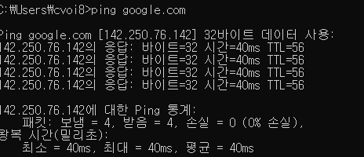
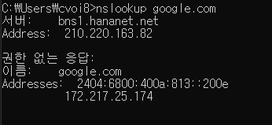

# 네트워크 스터디 1주차 과제

<u>**Gateway 리뷰 or 네트워크 관련 명령 10개 분석**</u>

## Gateway 리뷰


## 네트워크 관련 명령 10개 분석

### ipconfig / ifconfig / ip

  - ip를 확인하는 명령어

  - ipconfig (Window) / ifconfig (Linux)
    - **ipconfig / ifconfig** 는 interface configuration의 약자로, 리눅스의 네트워크 관리를 위한 인터페이스 구성 유틸리티 명령어  
    네트워크 인터페이스 구성을 확인 할 수 있는 명령어지만, 비활성화된 네트워크와 같은 상세한 정보는 나타내지 않음  
    ```
    ipconfig [/allcompartments] [Option]

    Option: 
      /?               이 도움말 메시지를 표시합니다.
      /all             전체 구성 정보를 표시합니다.
      /release         지정된 어댑터에 대한 IPv4 주소를 해제합니다.
      /release6        지정된 어댑터에 대한 IPv6 주소를 해제합니다.
      /renew           지정된 어댑터에 대한 IPv4 주소를 갱신합니다.
      /renew6          지정된 어댑터에 대한 IPv6 주소를 갱신합니다.
      /flushdns        DNS 확인 프로그램 캐시를 제거합니다.
      /registerdns     모든 DHCP 임대를 새로 고치고 DNS 이름을 다시 등록합니다.
      /displaydns      DNS 확인 프로그램 캐시 내용을 표시합니다.
      /showclassid     어댑터에 대해 허용된 모든 DHCP 클래스 ID를 표시합니다.
      /setclassid      DHCP 클래스 ID를 수정합니다.
      /showclassid6    adapter에 대해 허용된 IPv6 DHCP 클래스 ID를 모두 표시합니다.
      /setclassid6     IPv6 DHCP 클래스 ID를 수정합니다.
    ```
    리눅스의 경우 *ipconfig(ifconfig) -a*를 사용하여 모든 네트워크 인터페이스 구성을 확인할 수 있음
  - ifconfig , ip (Linux)  
    - **ip** 는 단독으로 사용할 수 없고, Option, Object 들과 같이 사용해야 하는 명령어
        ```
        ip [ OPTIONS ] OBJECT { COMMAND | help }
        ```        
        자주 사용되는 Option의 종류로는 link, address, route, maddr, neight등이 있음  
        여러가지 용도가 존재하는데 그 중 하나는 ip addr(ess)을 사용하여 현재 ip를 확인하는 방법이 있음  

### ping 
  - ping은 Packet Internet Groper의 약자로, 대상 컴퓨터를 향해 일정 크기의 패킷을 보낸 후
  대상 컴퓨터가 패킷을 받고, 이에 대한 응답 메시지를 보내면 이를 수신하여 컴퓨터 동작 여부 혹은 네트워크 상태를 파악할 수 있음

  - 해당 도메인의 IP를 확인할 때 주로 사용됨
  
    ```
    ping [IP or Domain]
    ```

    

### traceroute (Linux) / tracert (Window)

  - traceroute 명령어는 실행하는 컴퓨터에서 목적지 서버로 가는 네트워크 경로를 확인시켜 줌
  - ICMP 프로토콜을 제한하는 라우터가 중간에 있는 경우 해당 정보를 파악할 수 없음 (보안적 이슈가 있어 정보를 숨기는 것)
  - ping 명령어와 동일하게 ICMP 프로토콜을 이용하며, 패킷이 복수의 경로를 거쳐가며 목적지로 이동하게 됨  
  이때, 각 구간을 **홉(hop)**이라고 부름  

  - 패킷이 지나는 홉마다의 IP 주소와 구간 별 패킷이 이동하는 시간을 체크할 수 있음
    - 패킷이 목적지로 향하는 전체 경로를 파악할 수 있음
    - 경로에 존재하는 라우터의 정보를 확인할 수 있음
    - 각 경로에 도착하는데 걸리는 시간을 확인 할 수 있음

    = 통신에 문제가 있을 때 구체적으로 어디에서 패킷이 막히는 건지, 속도가 지연되는 건지를 확인 할 수 있음

      ```
      traceroute [도메인 명 or iP address]
      ```
    

### netstat

  - 네트워크 연결 상태, 라우팅 테이블, 인터페이스 상태 등을 보여주는 명령어  
  - 네트워크의 문제를 찾아내고 성능 측정으로서 네트워크 상의 트래픽의 양을 결정하기 위해 사용됨
  - 리눅스, 윈도우 둘 다 사용 가능함

    ```
    netstat [Option] | [포트 번호 | 서비스 명]
    ```

  ex ) netstat -nap : 연결을 기다리는 목록과 프로그램을 보여줌  
  netstat -an | grep 포트번호 : 특정 포트가 사용 중인지 확인함

### nslookup

  - DNS 서버에 관련하여 조회가 가능한 명령어
  - 서버의 네트워크가 제대로 설정되었는지 확인하는 용도로 사용됨

    ```
    nslookup [도메인 명] | [네임서버명 | ip address]
    ```

  - 도메인의 ip 정보가 리턴된다

  - 또는 nslookup 명령어만 입력할 경우 nslookup 프롬프트로 이동하게 되며, 여러가지 질의가 가능하다
    ```
    nslookup
    > google.com (네임서버명 입력)
    > set type=all (모든 정보를 조회)
    ```

    

### telnet

  - 포트가 열렸는지 간단하게 테스트하는 명령어

    ```
    telnet [도메인 네임서버] [포트 번호]
    ```

      
    - 서버가 막혀있어서 접속에는 실패함

### netsh

  - netsh (네트워크 셸) 은 네트워크 인터페이스를 제어하는 명령어
  - 네트워크 인터페이스와 관련하여 다양한 기능을 제공함
  - Netsh 컨텍스트라는 네트워킹 서버 역할 또는 기능과 관련된 명령 그룹이 존재하여, 다룰 수 있는 기능이 광범위하다
    ```
    netsh [-a AliasFile] [-c Context] [-r RemoteMachine] [-u [DomainName\]UserName] [-p Password | *] [Command | -f ScriptFile]

    -a              AliasFile을 실행한 후 netsh 셸로 돌아가도록 지정합니다.
    AliasFile	    하나 이상의 netsh 명령이 포함된 텍스트 파일 이름을 지정합니다.
    -c	            netsh가 지정된 netsh 컨텍스트로 전환되도록 지정합니다.
    Context	        입력하려는 netsh 컨텍스트를 지정합니다.
    -r	            원격 컴퓨터에서 명령을 실행하도록 지정합니다. 
                    원격 레지스트리 서비스는 원격 컴퓨터에서 실행 중이어야 합니다. 
                    실행되고 있지 않으면 Windows에 "네트워크 경로를 찾을 수 없음" 오류 메시지가 표시됩니다.
    RemoteComputer	구성하려는 원격 컴퓨터를 지정합니다.
    -u	            사용자 계정으로 netsh 명령을 실행하도록 지정합니다.
    DomainName\	    사용자 계정이 있는 도메인을 지정합니다. Do기본Name\이 지정되지 않은 경우 기본값은 로컬 do기본입니다.
    UserName	    사용자 계정 이름을 지정합니다.
    -p	            사용자 계정의 암호를 입력하도록 지정합니다.
    Password	    -uUserName으로 지정한 사용자 계정의 암호를 지정합니다.
    Command	        실행하려는 netsh 명령을 지정합니다.
    f-	            ScriptFile을 사용하여 지정한 스크립트를 실행한 후 netsh를 종료합니다.
    ScriptFile	    실행하려는 스크립트를 지정합니다.
    ```

    
  
    ```
    ex ) 
    netsh interface show interface (인터페이스 확인)
    netsh interface ipv4 show tcpconnections remoteport=80 (원격 포트가 80인 TCP 연결)
    netsh interface ipv4 show global (글로벌 구성 매개 변수 확인)
    ```

### arp  
  - ARP(주소 확인 프로토콜)에서 사용하는 IP 주소에서 물리적 주소로의 변환 표를 표시하고 수정하는 명령어

  - TCP/IP 명령어로, 시스템 사이의 통신에는 상대방의 MAC 주소가 필요한데,
  이때 arp는 ARP를 이용하여 상대 시스템 IP에 신호를 보내 MAC 주소를 받아옴

    ```
    arp [option]
    
    - option 종류
    
    -v : ARP 상태를 출력한다.  
    -t type : ARP 캐시에 올라와 있는 타입을 검색한다. ether(Enternet), ax25(AX25 packet radio)등이 있으며, ether가 기본 타입이다.  
    -a [host] : 등록된 호스트 중 지정한 호스트의 내용을 보여준다. 호스트를 지정하지 않으면 등록된 모든 호스트를 출력한다.
    ...etc
    ```

###  hostname

  - 시스템의 이름을 확인하거나 바꿀 때 사용하는 명령어

    ```
    hostname [option]

    - option 종류

    -d : 도메인 명을 출력
    -i : 호스트의 ip주소를 출력
    -y : NIS 도메인명을 출력
    ...etc
    ```

###  getmac

  - 시스템에 있는 네트워크 어댑터의 MAC 주소를 표시하는 명령어

    ```
    ex )
    getmac /v (네트워크 속성에 등록된 각 속성의 물리적 주소 값을 확인)
    getmac /v /fo list (물리적 주소를 리스트의 형식으로 확인)
    ```